# Systsim

## Project of the course Design of Dynamic Web Systems (M7011E), Luleå Tekniska Universitet.  

## INDEX
### 1. Introduction
### 2. Project Development
### 3. System Architecture
### 4. Data Modeling
### 5. API Specification
### 6. Authentication
### 7. System Walkthrough
### 8. Timelog
### 9. Conclusion

 

## 1. INTRODUCTION

This project consists of a simulation of privately owned wind power turbines, households and a power plant connected to an open market controlled by a central authority.

The members include consumers, prosumers (both producers and consumers) and a manager which is in charge of the Power Plant. This prosumers have wind power turbines which depending on the wind value generate a certain amount of electricity.

The system is intended to be built as a service oriented architecture which by implementing APIs in each of the members and modules allows to obtain data and include functionalities while untangling all the components.

 

## 2. PROJECT DEVELOPMENT

### VMs AND SERVICE HOSTING
For the hosting of the system we have used the LUDD Distributed Systems and Technologies (DUST) platform which offers the instantiation of Virtual Machines for the free use of the students.

We have set two VMs with each one:
- 4 vCPUs
- 4096MB RAM
- 32GB DISK
- Ubuntu 20.04 LTS

The first one named _devops-distributed-site-89_ has been used for executing our own private GitLab repository in which upload the code made during the development process.

The second one named _modular-distributed-compute-41_ has been used for executing Jenkins platform as well as Wekan for coordination in the group and the systsim service itself (giving because of this reason a public IP to the machine).

All code has been developed by using  _VisualStudioCode_ with the SSH extension being in this way able to develop, debug and test the code with our own machines but in a remote execution (making use of port forwarding).

### DIRECTORY TREE
The project started with the definition of the directory tree and the correct separation of elements to give order and coherence.

With this said, the main directories would be:
.  
├── app  
│   ├── core  
│   ├── modules  
│   └── shared  
└── environments  

The app directory as can be seen includes the main files that will define our system with the following elements:
- __core__ :: It contains the main files of the service, including the backend and simulation code as well as different utils function files that are used by them.
- __modules__ :: It contains the code of the different components of the system, like the database, the simulation logic, the api specification and the frontend.
- __shared__ :: It contains all the files used by the frontend (html, css and javascript files).

The environments directory includes the configuration files of the CI/CD tools used in this project, with these being ansible and jenkins.

### WORK COORDINATION

The work coordination of this project has been developed as said before, with both our own private _GitLab_ repository and the platform _Wekan_ used for creating and monitoring tasks during the development of a project.

The different components' code development has been divided into the following:
- __auth__ :: The authentication changes and necessary elements.
- __data__ :: The creation and coordination of the database (schemas) with both the backend and simulation services.
- __api-spec__ :: The definition of all interaction between the different components of the system following the Service Oriented Architecture, i.e. the Application Programming Interfaces of the components.
- __logic__ :: The definition of the members in an Object Oriented Programming as well as the simulation service implementation.
- __sspec__ :: The documentation related to the system's architecture including graphical schemas of the components, objects and API interaction.

 

## 3. SYSTEM ARCHITECTURE

### HIGH-LEVEL SCHEMA
The following image shows a High-Level Schema of the System's Architecture by displaying the different components and the tools used for each one of them.
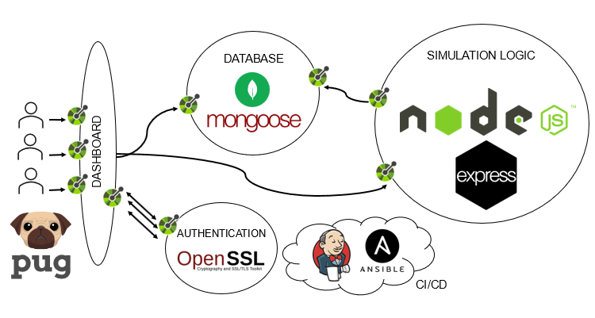

For the __Simulation component__, the Backend and the Frontend, NodeJS with Express has been used:
- _Node.js_ is an open-source, cross-platform, back-end JavaScript runtime environment that runs on the V8 engine and executes JavaScript code outside a web browser.
- _Express_ is a minimal and flexible Node.js web application framework that provides a robust set of features to develop web and mobile  applications.

For the __Database component__, MongoDB with Mongoose has been used:
- _MongoDB_ is amsource-available cross-platform document-oriented database program. Classified as a NoSQL database program, MongoDB uses JSON-like documents with optional schemas.

  __Mongoose_ provides a straight-forward, schema-based solution to model your application data. It includes built-in type casting, validation, query building, business logic hooks and more, out of the box.

For the __Dashboard component__, pug has been used:

- _Pug_ is a clean, whitespace-sensitive template language for writing HTML. Itis a high performance template engine implemented with JavaScript for Node.js and browsers.

For the __Authentication component__, OpenSSL has been used:
- _OpenSSL_ is a robust, commercial-grade, full-featured toolkit for general-purpose cryptography and secure communication.

For the __CI/CD__, both Jenkins and Ansible have been used:
- _Jenkins_ is an open source automation server which enables developers around the world to reliably build, test, and deploy their software.
- _Ansible_ is an open-source software provisioning, configuration management, and application-deployment tool enabling infrastructure as code.

For the __interaction between all this components__ both Swagger and OpenAPI have been used:

- _Swagger_ allows you to describe the structure of your APIs so that machines can read them. 
- _The OpenAPI Specification (OAS)_ defines a standard, language-agnostic  interface to RESTful APIs which allows both humans and computers to  discover and understand the capabilities of the service without access  to source code, documentation, or through network traffic inspection

### LOW-LEVEL SCHEMA
The following image shows a Low-Level Schema of the System's Architecture by displaying the different components as processes and the interaction between them through HTTP requests.

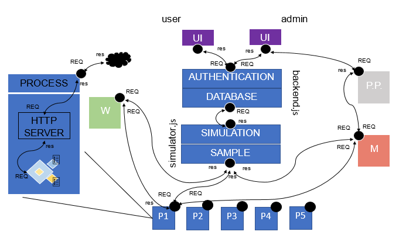

The service starts as the execution of two parallel processes:

- __node backend.js__ :: It includes the backend's API which manages the database and the frontend's API which manages the UI's requests, together with the authentication module as an integrated section of both.
- __node simulator.js__ :: Makes the spawning of independent processes that simulate the Wind, Market and PowerPlant as well as that of the Consumers and Prosumers which include an object of their type and answer to the HTTP requests with the temporal updated information.

The simulator also includes a sampling section which periodically samples the different processes and updates the DB, this way the users only need to sample from the database and do not interact with the consumer/prosumer process. 

This implementation has been considered trying to approach a more realistic system, considering each process as the one that would be run in each of the houses (for the consumer/prosumer). It tries to resemble a SOA by considering each piece of information or functionality a service that can be called through HTTP requests.

As every process would implement an HTTP server with a defined API, for the Market, Wind and PowerPlant modules it would be the same as obtaining the information from an API of real Market, Wind and PowerPlant values.

 

## 4. DATA MODELING

The following image indicates the logic UML schema of the OOP elements that are used during the simulation and used for the definition of the DB schemas.

For the get and set operations, as the DB API is intended as RESTful-like, they would be equivalent to the GET and PUT operations, with the POST and DELETE ones for respectively the creation and deletion of the object in the DB.

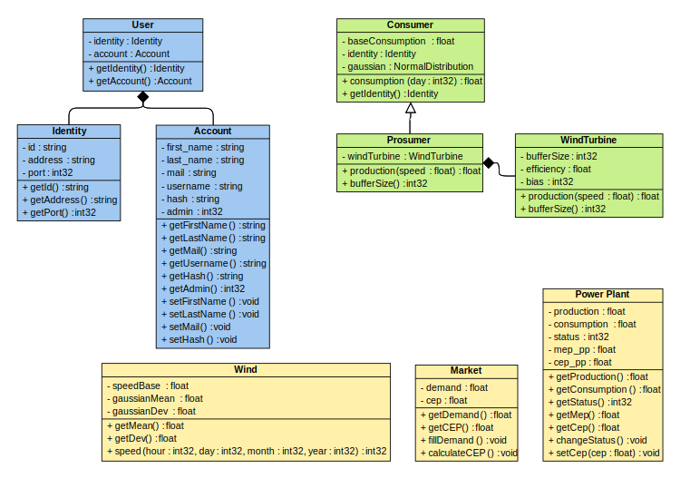

### REGISTRATION OBJECTS

- __User__
  - _identity_, the Identity object.
  - _account_, the Account object.
- __Identity__
  - _id_, the object identifier.
  - _address_, the address of the consumer/prosumer process.
  - _port_, the port of the consumer/prosumer process.
- __Account__
  - _first_name_, the first_name of the person.
  - _last_name_, the last_name of the person.
  - _mail_, the email of the person.
  - _username_, the username of the person.
  - _hash_, the hash of the password of the person.
  - _admin_, 0 if not admin and 1 if admin.

### SIMULATION MEMBER OBJECTS

- __Consumer__
  - _baseConsumption_, the bias of the consumption.
  - _identity_, the Identity object.
  - _gaussian_, the NormalDistribution object that models the evolution of the consumption.
    - _consumption(day)_, the consumption for a certain day.
- __Prosumer__
  - _windTurbine_, the Wind Turbine object.
    - _production(speed)_, the production with a certain wind speed.
    - _bufferSize()_, the size of the buffer at this instant.
- __WindTurbine__
  - _bufferSize_, the size of the electricity buffer of the house.
  - _efficiency_, the efficiency of the wind turbine's dynamo.
  - _bias_, the bias of the production.
    - _production(speed)_,  the production with a certain wind speed.
    - _bufferSize()_, the size of the buffer at this instant.

### SIMULATION MODULE OBJECTS

- __Wind__
  - _speedBase_, the bias of the speed.
  - _gaussianMean_, the mean of the gaussian distribution.
  - _gaussianDev_, the deviation of the gaussian distribution.
    - _speed(hour, day, month, year)_, the wind speed for a certain hour, day, month and year.
- __Market__
  - _demand_, the demand of the market.
  - _cep_, the current electricity price of the market.
    - _fillDemand()_, fills the demand attribute by querying all the members of the system and calculating the new value.
    - _calculateCEP()_, fills the cep attribute by querying all the members of the system and calculating the new value.
- __Power Plant__
  - _production_, the production of the power plant.
  - _consumption_, the consumption of the power plant.
  - _status_, the status of the power plant (stopped, starting, running).
  - _mep_pp_, the modeled electricity price of the power plant.
  - _cep_pp_, the current electricity price of the power plant.
    - _changeStatus()_, changes the status of the power plant.
    - _setCep(cep), changes the cep of the power plant.

The attributes and methods specified and used in the simulation logic objects are not all that there are in the DB schemas as the needed information for the simulation is covered with the ones shown above but not for the frontend functionalities that are required.

 

## 5. API SPECIFICATION

The following image shows the UML schema of the API components that interact within the system. The information regarding the contents of each component can be found in the following link:
  - http://systsim.ddns.net:12345/api-docs/

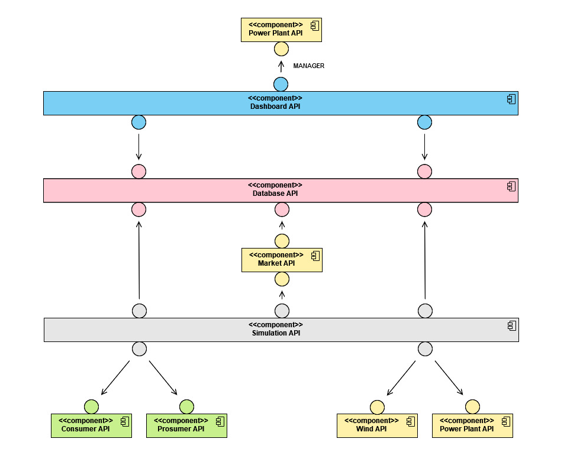

The Dashboard API contains all routes for rendering the HTML pages and obtaining the information of the system from the database. Authentication is integrated in this API through username/password.
  - The user has access to the information associated with the process that simulates its house and consumption.
  - The manager has access to the information of the users by obtaining information from the DB but also to the Power Plant's system (simulated also by a process) which has also an API defined.

The Database API contains the classical CRUD operations for each schema defined within the GET, POST, PUT and DELETE RESTful operations. This allows for Creating, Reading, Updating and Deleting elements in a database that can be located in another server.
  - Some limitations of this implementation are that it is not possible to update only an attribute, it is necessary to obtain all the attribute values of that object to update it (GET -> PUT from the user's view).
  - This arises the problem that in a certain instant the values used for the consumption/production when changing a 'static' attribute can be different from the ones that the DB contains (as it updates dynamically).

The Simulation API samples all the contents from the system members and modules and manages the creation and deletion of the processes that simulate the consumers/prosumers, therefore updating the DB.
  - Due to time restrictions, it could not be implemented as it was intended, forcing the sampling as a whole and returning information from all the modules and members instead of just a certain module or a group of members.

The Market API offers a way to access the Market object's attributes that contain the Market simulation.
  - For calculating the _demand_ and the _currentElectricityPrice_, the API needs information about the consumption of the system members. It obtains it from the database and updates them.

The Power Plant API offers a way to access the Power Plant object's attributes that contain the Power Plant simulation.
  - The Power Plant's information is not contained in the Database as only the manager should be able to access it, so after authentication, he would be able to obatin it directly from the HTTP server implemented in the process that simulates it.

The Wind API offers a way to access the Wind object's attributes that contain the Wind simulation.

Each Consumer and Prosumer process would implement respectively the Consumer or Prosumer's API that is associated with the server that simulates each of the houses and that would have access to its consumption (and production if prosumer).

 

## 6. AUTHENTICATION

The authentication of this system is very weak. Although we managed to obtain a domain, we needed to pay in order to associate a certificate with it, so the web page is hosted on an HTTP server.

For palliating the obvious security issues that would arise from this problem, some let's say 'not-standard' solutions have been implemented:
  - All operations regarding parameters are done via POST requests, so that a non-informatic user would not be able to see how the web page could work (although if a person with some knowledge where to sniff the requests and see the body, it would all be in vain).
  - For the sending of credentials, the password is previously converted into a hash so that the information that could be sniffed would not include the real password (although if a person where to make the same requests by using the username and hash then it would have access to this user's system).

Although TLS could not be implemented due to the domain provider, both the code for using HTTPS and the certificates (may be not the best but the code is hold in a private repository) are included.

 

## 7. SYSTEM WALKTHROUGH

This section will include a simple system walkthrough for the different pages that a user might encounter:

### HOME PAGE
The home page offers two options, login or registering into the system.

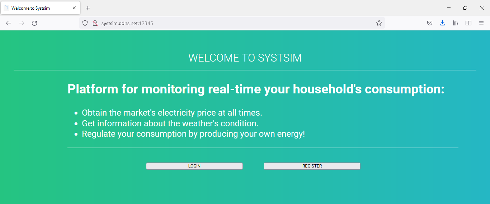

### LOGIN PAGE
The login page requires username and passowrd in order to authenticate the user.

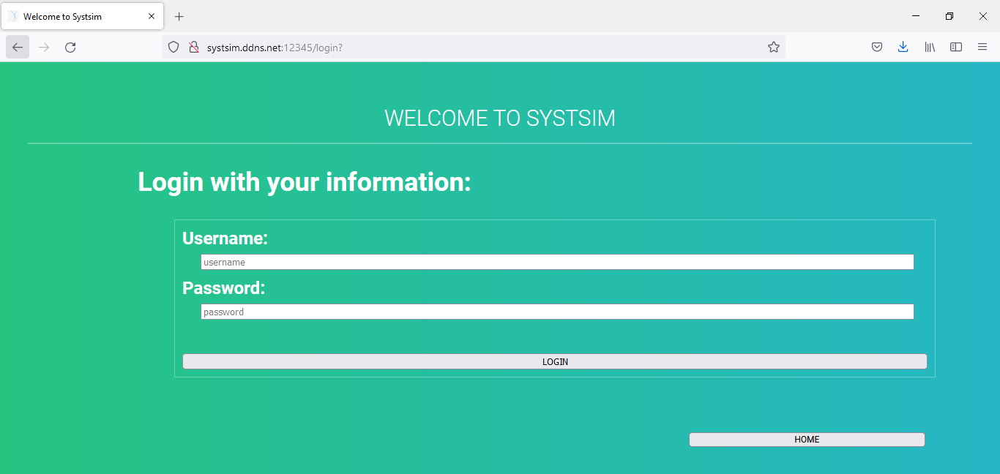

Let's continue with the login of the manager, for which we have the following credentials: 
  - {username: admin, password: admin}.

### MANAGER PAGE
The manager page shows the values sampled from the Power Plant and updates them every 4 seconds. 
  - Elements with a different color allow changing for a new value by clicking on them, what makes the page ask for a value and in the next updating, showing it. It updates this value also in the Power Plant's object of the process.

The Logout button returns to the home page, whether as the Show Accounts button leads to another page with the information of all the users of the system.

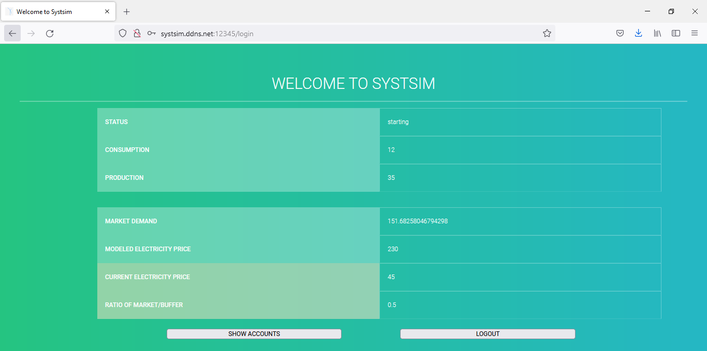

### ACCOUNTS PAGE
The accounts page shows the basic information of the different users of the system, including the UserID, the Address of the process (simulated house) and the Type of Member (consumer/prosumer).

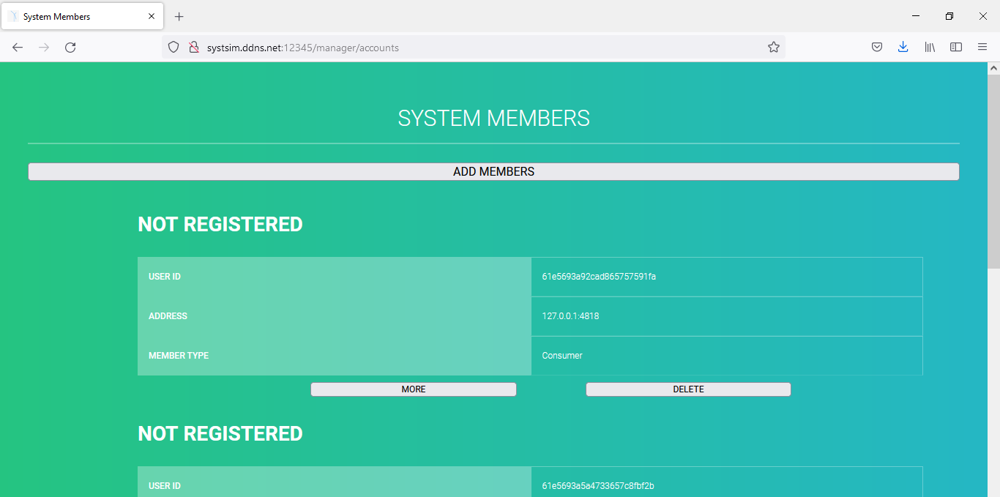

The page offers the possibility for each user of showing more information, this would lead to a new page that would periodically update the information as in the manager page but for the user's parameters.

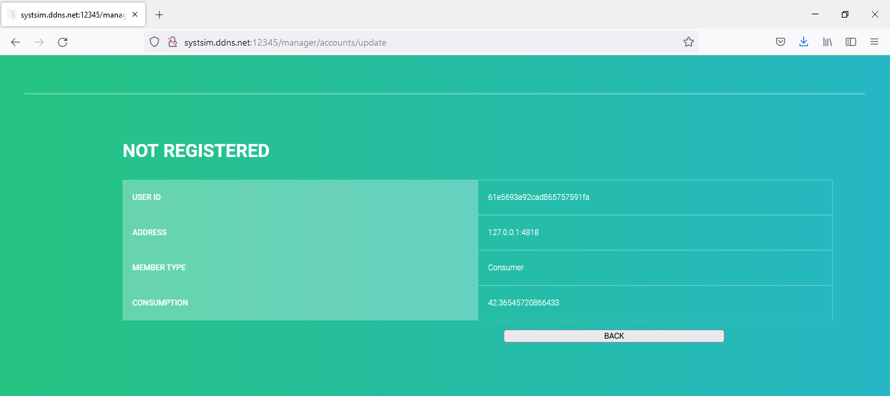

It is also possible to add and delete users, this section is also constrained to the simulation and how it was modeled (as an interaction of processes), so both operations need to create and delete processes and create and delete entries in the database.

The following image displays the original processes of the systsim service:

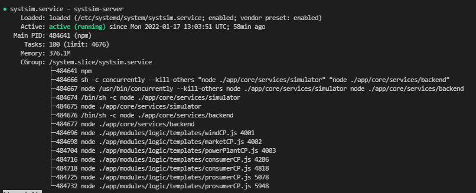

When the delete button for a certain user is actioned, all the components coordinate between themselves to remove a user from the system. In this case, the user selected was the one with the port 4818:

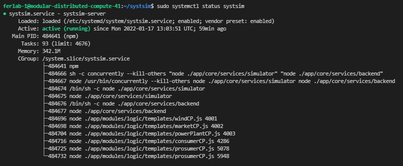

If we were to add another user to the system then we would simply have to action the Add Members button and after selecting if it would be a consumer or prosumer, the components would coordinate for adding a new user.  In this case, the user create is the one with the port 4912:

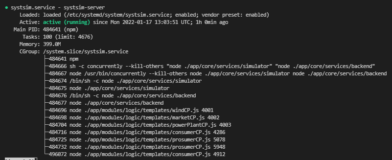

We have thought of the registration like this: Imagine a technician goes to the house of a person and installs the power turbine and configures the router of this house for letting information go through. Then we have a user who consumes (or consumes and produces) but of whom we do not have its credentials.

Our idea is that this technician would give the person an identifier which is then asked during registration time, and with this, all personal information and credentials would be updated.

Let's consider the first user and register him in the system.

### REGISTER PAGE
It would required firstName, lastName, email, username, password and the identifier mentioned before.

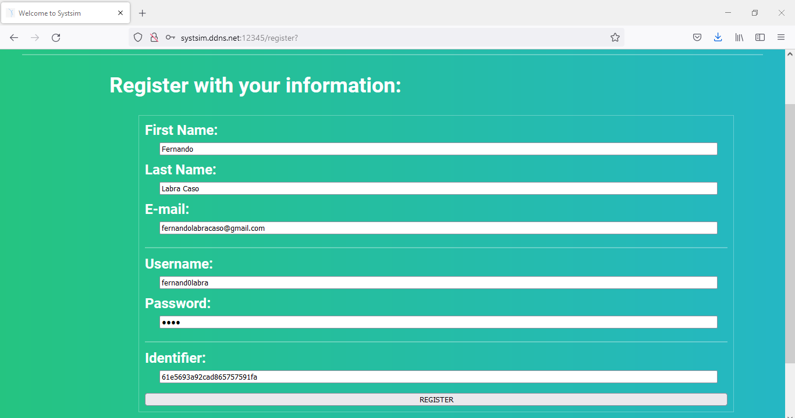

Once registered it would route to the user's main page.

### USER PAGE
With the previous data, we have fulfilled the personal information associated with a consumer and the following image displays the general information that the user should know updating every 4 seconds.

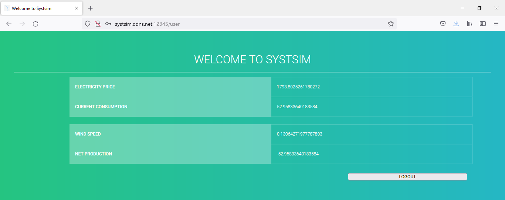

For a prosumer the user's page would be as follows, also updating every 4 seconds and with the possibility to change the values remarked in a different color:

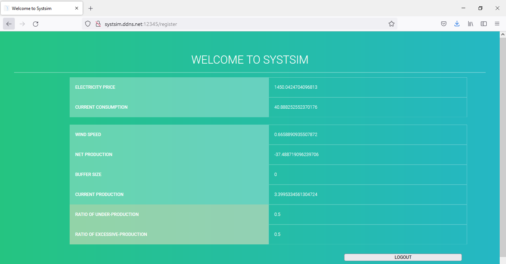

If we were to login again with the manager and get the accounts page, we would see that changes have been applied regarding this personal information:

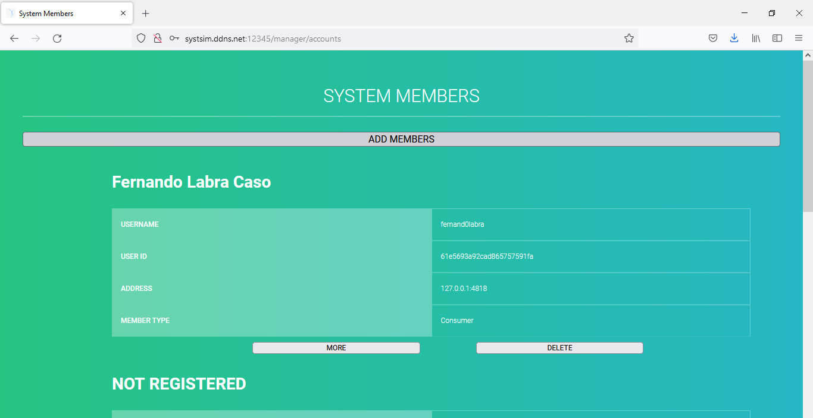

It would also update in the specific user information for both the consumer and prosumer:

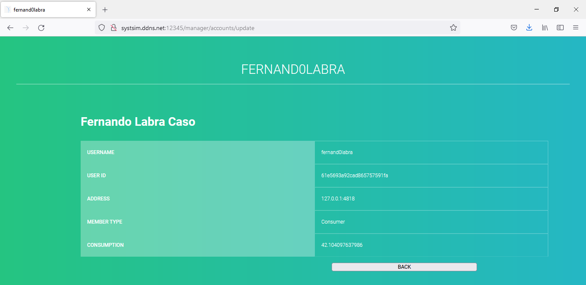

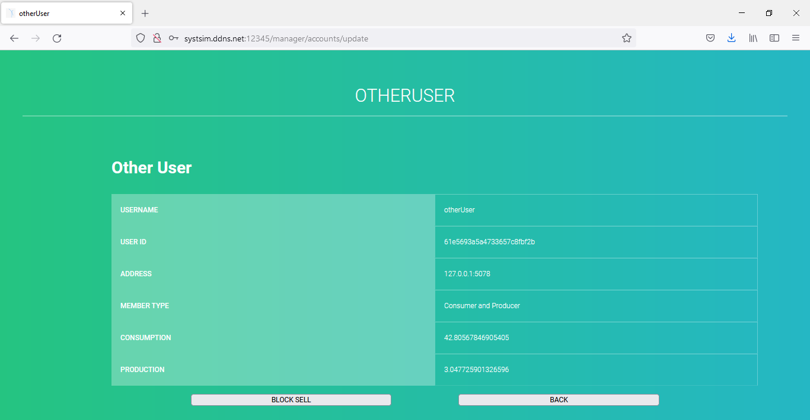

 

## 8. TIMELOG

In this section, information on the actual time spent on the different tasks will be found. It is divided by student, taking into account the dates, tasks and time spent on each task.

### FERNANDO LABRA CASO

| Date          | Task            | Time spent |
| :------------ |:---------------:| ----------:|
| 2021-11-02 | Introductory meeting | 1h |
| 2021-11-03 | Organization meeting | 2h |
| 2021-11-03 | Set up working environments | 4h |
| 2021-11-03 | Become familiar with working environments | 1h |
| 2021-11-03 | Set up working environments | 4h |
| 2021-11-04 | Logic members definition | 2h |
| 2021-11-06 | Set up working environments | 4h |
| 2021-11-08 | Consumption Model Definition | 1h |
| 2021-11-09 | Wind Speed Model Definiton | 1h |
| 2021-11-10 | Coal Power Plant Definition | 2h |
| 2021-11-10 | Market Module Definition | 3h |
| 2021-11-11 | Electricity Price Module Definition | 2h |
| 2021-11-29 | Organization meeting | 1h |
| 2021-11-30 | System Architecture | 3h |
| 2021-11-30 | Meeting | 1h |
| 2021-12-01 | mongodb research | 3h |
| 2021-12-02 | Organization meeting | 1h |
| 2021-12-03 | Main members definition | 1h |
| 2021-12-05 | Define member APIs | 1h |
| 2021-12-13 | Organization meeting | 1h |
| 2021-12-14 | Presentation meeting | 1h |
| 2021-12-15 | Presentation | 2h |
| 2021-12-19 | Set up Database | 6h |
| 2021-12-20 | Set up Database | 2h |
| 2021-12-21 | Define Database API | 8h |
| 2021-12-22 | Define Database API | 8h |
| 2021-12-23 | Integrate Database with Simulation | 6h |
| 2021-12-01 | Integrate Database with Simulation | 6h |
| 2021-12-02 | Develop Manager's Frontend | 7h |
| 2021-12-03 | Develop Manager's Frontend | 7h |
| 2021-12-04 | Develop Manager's Frontend | 7h |
| 2021-12-05 | Develop Manager's Frontend | 7h |
| 2021-12-06 | Develop User's Frontend | 7h |
| 2021-12-07 | Develop User's Frontend | 7h |
| 2021-12-08 | Define Frontend API | 7h |
| 2021-12-09 | Define Simulation API  | 7h |
| 2021-12-10 | Documentation  | 7h |
| 2021-12-11 | Documentation  | 7h |
| 2021-12-12 | Debugging and Deployment  | 5h |
| 2021-12-13 | Debugging and Deployment  | 5h |
| 2021-12-16 | Documentation  | 5h |
| 2021-12-17 | Documentation  | 5h |

 

### FERNANDO CASTELL MIÑÓN

| Date          | Task            | Time spent |
| :------------ |:---------------:| -----:     |
| 2021-11-02 | Introductory meeting | 1h |
| 2021-11-03 | Become familiar with working environments | 3h |
| 2021-11-04 | Become familiar with working environments | 3h |
| 2021-11-19 | Organization meeting | 1h |
| 2021-11-29 | Organization meeting | 1h |
| 2021-11-05 | API Documentation update |    1h |
| 2021-11-15 | Timelog update | 20' |
| 2021-11-16 | API Documentation update |    1h |
| 2021-11-30 | Timelog update | 20' |
| 2021-12-10 | Timelog update | 20' |
| 2021-12-13 | Organization meeting | 1h |
| 2021-12-13 | Documentation udpate  | 1h |
| 2021-12-14 | Presentation meeting | 1h |
| 2021-12-13 | Documentation udpate  | 1h |
| 2021-12-15 | Timelog update | 20' |

 

## 9. CONCLUSION

This service development has shown us both the importance of a good organization and our limits as proffesionals in the programming field. We have struggled with developing this system as all the tools and the coding of APIs, request/responses, promises, etc. were almost completely unknown (except for HTML and CSS).

Overall, we think that our view of the system with the process interaction in a Service Oriented Architecture more than suffices the requirements for the logic and APIs. For the user and manager's frontend as well as the database we feel we have achieved a good result and finally; for the simulation and authentication, we feel that more could have been done. 
  - We focused too much on the correct interaction of all the components that forgot about coherent values in the simulation, as well as other functionalities such as buffer updating, excessive production behavior and under production behavior.
  - Authentication was not something that was not considered, but due to the previously mentioned problems with the domain provider, all that we could do regarding TLS was generating certificates for a later deployment of an HTTPS server.

As for what we think a good mark would be, we have to say that considering the difficulties of a totally new environment and the final result, though may be not as complicated as it could be and with as many functionalities as required; it perfectly reflects the working architecture of a web system with a constant interaction of well defined components through APIs, offering values to a user in both a Service Oriented and RESTful way.

For this reason with a mark basing on a 5, we think that a 3 would have been more than achieved and a 4 would be possible depending on the consideration of the graders in respect to our idea of independent processes coordinating together.